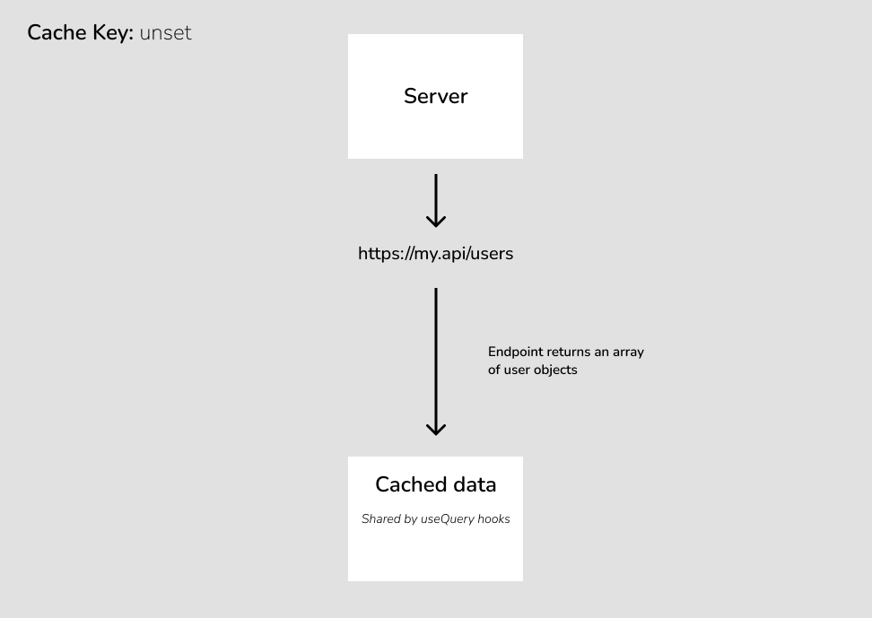
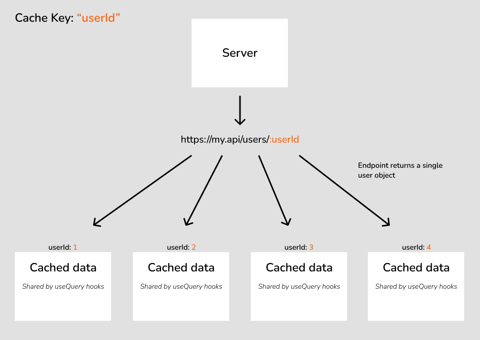

# Caching

I find it helps to break caching down into two core concepts:

#### 1. Structure

Using the `cacheKey` property to ensure that data is correctly siloed across the application. This prevents the wrong data from showing up in the wrong place.

#### 2. Validity

Using invalidation to ensure that the user is seeing the latest data when you _know_ that it's changed.

## Cache Keys - Structuring the State

### The anatomy of a cache key value

Behind the scenes, all API SWR cache key values are strings made up of multiple parts separated by a `.`. The first two parts are always the same, with subsequent parts depending on how your query was configured.

#### 1. The controller key

The first part of the cache key value is always the `controllerKey`. This string was passed as the first argument when you set up your controller, and should be unique across all controllers within your app:

```TypeScript
// The string "user" is the controllerKey for this controller
export const userApi = apiFactory.createAxiosOpenApiController("user", UserApi);
```

#### 2. The endpointId

The second part of the cache key value is always the `endpointKey`. This is derived from the endpoint name within the passed in API Client. Continuing our `userApi` example, the following query:

```TypeScript
userApi.getUser.useQuery()
```

will always have the following initial cache key:

```
user.getUser
```

_NOTE: This initial two-part cache key value (`controllerKey.endpointKey`) is referenced throughout API SWR as an `endpointId`. It's an essential component to all queries and ensures cache separation across the different endpoints within the app._

#### 3. Additional parts

All subsequent parts of the cache key value are supplied using the `cacheKey` config field on [useQuery](use-query.md) and [useInfiniteQuery](use-infinite-query.md). Please see the the "How do I use a cache key?" section below to see how the different ways of passing this piece of config effect the final cache key value.

### When do I use a cache key?

For endpoints that don't receive parameters, the default "one endpoint to one cache bucket" relationship is all that's required. Take, for example, an endpoint that returns an array of user objects:



In the above example, the endpoint returns a consistent set of data that all [useQuery](use-query.md) instances can share, so no cache key is required.

However, for an endpoint that returns a different data set based on one or more parameters, the above example wouldn't be appropriate. Say, for example, we have an endpoint that returns a single user object based on a `userId` parameter. The "one endpoint to one cache bucket" relationship would mean that User 2's data would overwrite User 1's data within the global state, which would likely cause bugs in the UI when a component requests User 1 and receives the cached data for User 2.

This is where the `cacheKey` property comes into play. The correct solution for the above example is to set the `cacheKey` on our `/users/:userId` endpoint to the "userId" parameter. This means that multiple cache buckets will be created for a single endpoint, one for each different "userId" argument sent to the endpoint, like so:



This ensures that there will be no crossed wires when individual users are requested from the API.

### How do I use a cache key?

There are three different approaches to supplying a cache key.

#### By parameter name

The simplest way to specify a `cacheKey` is to supply an API parameter name, the value of which will form the key that the data is cached by. This is the structure being used in the above `/users/:userId` example, where `userId` is the name of the cache key parameter:

```TypeScript
export const useGetUser = (userId: string) => {
  return userApi.getUser.useQuery({
    cacheKey: 'userId',
    params: { userId }
  })
};
```

_NOTE: TypeScript will insist that any string passed to `cacheKey` must be the name of a parameter. If you need to cache by a string value, the "By function" structure will need to be used, see below._

_WHAT'S THE FINAL CACHE KEY VALUE?: Assuming the `userId` parameter in the above example is `1`, the final cache key value for this query will be `user.getUser.1`. Please see the above "The anatomy of a cache key value" section to understand what this means._

#### By array of parameter names

Exactly the same as above, but an array of parameter names which form uniqueness when combined. This is particularly relevant for paged endpoints:

```TypeScript
export const useGetUsers = (page: number, pageSize: number) => {
  return userApi.getUsers.useQuery({
    cacheKey: ['page', 'pageSize'],
    params: { page, pageSize }
  })
};
```

_WHAT'S THE FINAL CACHE KEY VALUE?: Assuming the `page` parameter in the above example is `1`, and the `pageSize` parameter is `10`, the final cache key value for this query will be `user.getUsers.1.10`. Please see the above "The anatomy of a cache key value" section to understand what this means._

#### By function

A cache key can also be compiled from a function that returns a string, this is particularly useful for nested parameter fields. The function will receive the grouped parameters object as it's only argument.

In this example, our user query is cached by a combination of id and role, both parameters are nested within a data object:

```TypeScript
export const useGetUser = (id: string, role: Role) => {
  return userApi.getUser.useQuery({
    cacheKey: params => `${params.data.role}-${params.data.id}`,
    params: { data: { id, role } }
  })
};
```

_WHAT'S THE FINAL CACHE KEY VALUE?: Assuming the `id` parameter in the above example is `1`, and the `role` parameter is `administrator`, the final cache key value for this query will be `user.getUser.administrator-1`. Please see the above "The anatomy of a cache key value" section to understand what this means._

## The invalidate function - Validating the State

When performing a mutation which results in a data change, it's important to invalidate any associated state from a [useQuery](use-query.md) or [useInfiniteQuery](use-infinite-query.md).

Take for example the below user update mutation hook. We _know_ that a successful update to the user object will immediately make both the user list data and individual user data stale, so we need to invalidate the cache like so:

```TypeScript
export const useUpdateUser = () => {
  const { invalidate } = useCacheManager();
  const { clientFetch, ...rest } = userApi.updateUser.useMutation();

  const updateUser = React.useCallback(async (user: IUser) => {
    // run the user update
    const response = await clientFetch({ user });
    // if it was successful
    if (response.data) {
      // invalidate all cache associated with the `getUsers` list query
      invalidate(userApi.getUsers.startsWithInvalidator());
      // invalidate all cache associated with the specific user that's been updated (based on their cache key)
      invalidate(userApi.getUser.cacheKey(response.data.id));
    }
    return response;
  }, [clientFetch]);

  return { updateUser, ...rest };
};
```

Invalidating cache does one of two things depending on whether the newly invalidated data is currently being rendered via a [useQuery](use-query.md) or [useInfiniteQuery](use-infinite-query.md) hook:

1. **Data is currently being rendered at invalidation time**: This will cause an immediate refetch from the server on the query in question.
2. **Data is not being rendered at invalidation time**: This will invalidate the cached data behind the scenes, and force a refetch from the server the next time the data is used.

### Invalidating an infinite query

SWR doesn't handle global invalidations of infinite queries very well. Luckily, API-SWR has you covered by providing a special invalidation hook designed for infinite queries. This hook only requires the `cacheKey`, ne need to worry about `startsWithInvalidator` here:

```TypeScript
export const useUpdateUser = () => {
  const { invalidateInfinite, invalidate } = useCacheManager();
  const { clientFetch, ...rest } = userApi.updateUser.useMutation();

  const updateUser = React.useCallback(async (user: IUser) => {
    // run the user update
    const response = await clientFetch({ user });
    // if it was successful
    if (response.data) {
      // invalidate all cache associated with the `getUsers` infinite list query
      invalidateInfinite(userApi.getUsers.cacheKey());
      // invalidate all cache associated with the specific user that's been updated (based on their cache key)
      invalidate(userApi.getUser.cacheKey(response.data.id));
    }
    return response;
  }, [clientFetch]);

  return { updateUser, ...rest };
};
```

### Knowing what to invalidate

API SWR provides two helper functions for accessing the cache key associated with a specific endpoint. If you haven't yet read "The anatomy of a cache key value" section above, please do that first in order to understand what a cache key value is.

#### For the exact cache key value:

The `cacheKey` function available on each endpoint will return the `endpointId` of the endpoint in question. The `endpointId` is the initial part of all API SWR cache key values:

```TypeScript
userApi.getUser.cacheKey() = 'user.getUser';
```

If additional parts are supplied to the `cacheKey` function, (either by string or array of strings), these will be appended to the cache key value like this:

```TypeScript
const userId = '1';
userApi.getUser.cacheKey(userId) = 'user.getUser.1';

const page = '1';
const pageSize = '10';
userApi.getUsers.cacheKey([page, pageSize]) = 'user.getUsers.1.10';
// ^ Although a valid example, this almost certainly isn't what you want for paging as it'll only invalidate page 1. Keep reading for the `startsWithInvalidator`
```

So if we look at this line from our initial mutation hook example above:

```TypeScript
invalidate(userApi.getUser.cacheKey(response.data.id))
```

This will invalidate the cache for a specific user within a specific endpoint.

#### For all data that starts with a cache key value (not relevant for infinite queries)

The `startsWithInvalidator` function available on on each endpoint works in exactly the same way as the `cacheKey` function, but it allows you to invalidate all cached data with a cache key that **starts with** the supplied cache key. This is particularly useful for paged endpoints for which the page number is supplied as a cacheKey parameter, but you want to invalidate _all_ pages.

So if we look at this line from our initial mutation hook example above:

```TypeScript
invalidate(userApi.getUsers.startsWithInvalidator())
```

This will invalidate all pages of our paged `user.getUsers` endpoint.

## Clearing all cache

The `useCacheManager` hook provides a method for clearing all cache associated with your app (usually called on logout or similar context reset scenarios). Here's an example:

```TypeScript
const { clearAll } = useCacheManager();

const logout = React.useCallback(() => {
  clearAll();
}, []);
```

## Other tools returned by `useCacheManager`

- `mutateInfinite` - similar to `invalidateInfinite` but also supports the other arguments on the [SWR global mutate](https://swr.vercel.app/docs/mutation#global-mutate) for more advanced cache management.
- The `useCacheManager` hook also returns everything returned by the SWR `useSWRConfig` for full control over your cache.

## SWR Documentation

For further information on how SWR handles caching under the hood, take a look at their documentation [here](https://swr.vercel.app/docs/advanced/cache).
