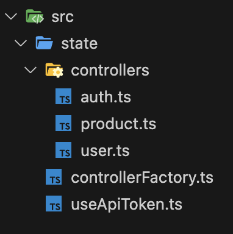
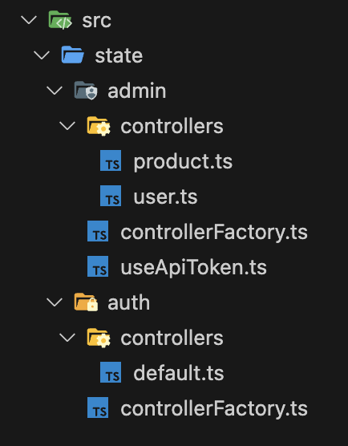

# File Structure

API SWR encourages a "one file per controller" approach. You're likely to end up with a lot of endpoint hooks, so splitting them up across multiple files is recommended.

Here are some file structure examples depending on the complexity of your API setup:

## Single API

- `state` folder within `src`.
  - Contains a `controllerFactory` file for your controller factory
  - Contains a `controllers` sub folder containing a file for each controller
  - Contains files for any shared utility hooks relating to state
- Each controller file (`auth.ts` for example) should export the controller and it's associated endpoint hooks.



### `controllerFactory.ts` should look like this:

```TypeScript
import { axiosOpenApiControllerFactory } from '@rocketmakers/api-swr';

export const apiFactory = axiosOpenApiControllerFactory({
  basePath: 'https://my.example.api/dev',
});
```

### A controller file (e.g. `user.ts`) might look like this:

```TypeScript
import { apiFactory } from "../controllerFactory.ts"
import { UserApi } from "example-api-client";
import { useApiToken } from "../useApiToken.ts"

export const userApi = apiFactory.createAxiosOpenApiController("user", UserApi);

export const useGetUser = (userId: string) => {
  const apiTokenHeader = useApiToken();
  return userApi.getUser.useQuery({
    cacheKey: 'userId',
    params: { userId },
    fetchConfig: { headers: { ...apiTokenHeader } }
  })
};
```

## Multiple APIs

If you need to interface with multiple APIs, you'll need a new `controllerFactory` for each one. Therefore the recommended approach would be to duplicate the above structure for each API by using an extra level of sub-folders within the root `state` folder.

The below example interfaces with two APIs called `auth` and `admin`:


